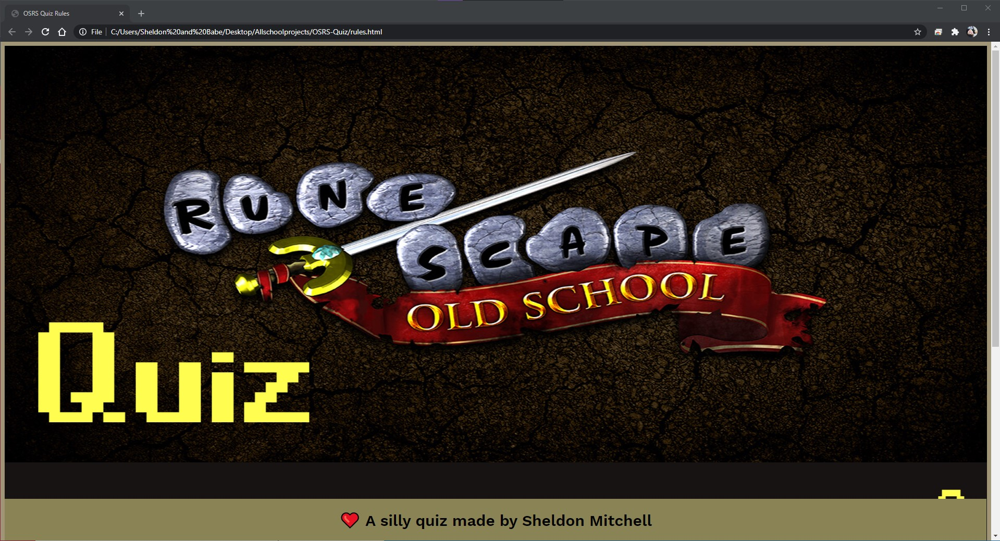
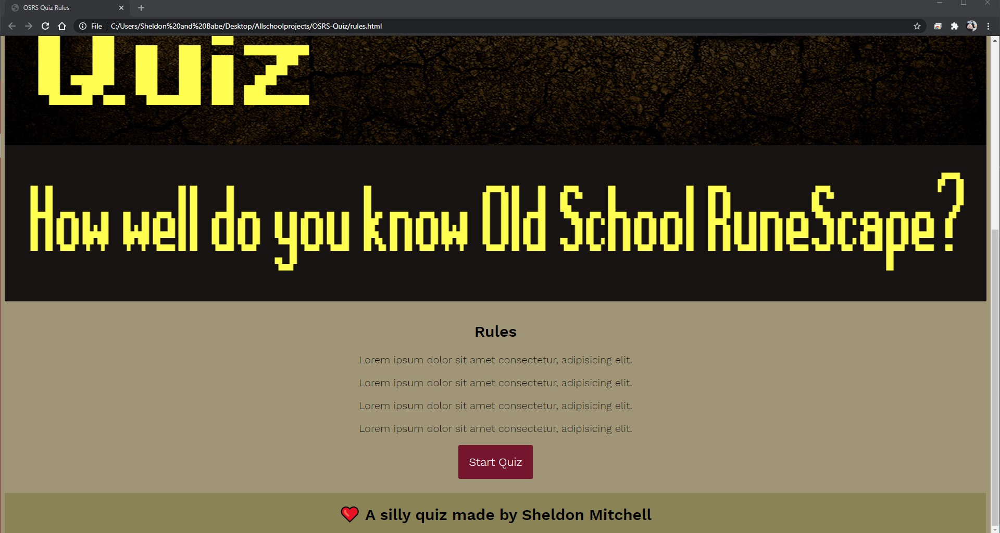
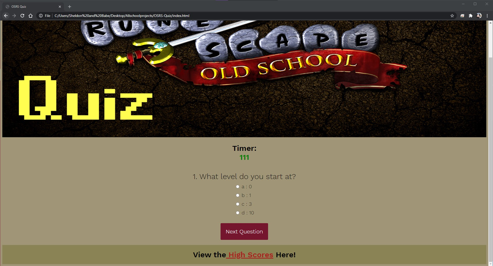

# OSRS-Quiz
This is just a quiz for a game I play. I tried to make it a lot better but I couldnt figure it out..

# user
A quiz to test your game knowledge.

# acceptance criteria
GIVEN I am taking a code quiz
## I have a start button that starts the quiz on the rules.html. I couldn't figure out how to make it be the first html that pulls up on the live site.. but I will.
WHEN I click the start button
THEN a timer starts and I am presented with a question

## Got it
WHEN I answer a question
THEN I am presented with another question

## I incorperated this in a different way. When you dont select an answer it does subtract 10 seconds from the clock for each wrong answer and adds 5 seconds for each correct answer. I was going to include on the rules page that you have 120 seconds to complete the quiz with a 5 second starting buffer. If you finish the quiz with above 0 seconds left you 'win' and if the timer goes to zero or below you lose automatically. The kicker was that the time doesnt get deducted or added until you hit submit and the results are shown at the end of the quiz. I thought it added a fun mystery factor to the quiz.
WHEN I answer a question incorrectly
THEN time is subtracted from the clock

## Got it
WHEN all questions are answered or the timer reaches 0
THEN the game is over

# I absolutely could not figure out how to make this work with my quiz but I will.. I just need more guidance. 
WHEN the game is over
THEN I can save my initials and score

# Notes
THE GAME IS SUPPOSED TO START FROM THE rules.html file but I cant get it to load first on the live site. 

# Mockup

# links 
https://sstevens22.github.io/OSRS-Quiz/

https://github.com/sstevens22/OSRS-Quiz